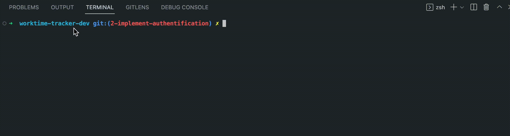

# version-incrementer

This package is used to increment the version of the package.json file.



## Usage

install the package

```bash
npm install package-version-incrementer
```

or globally

```bash
npm install -g package-version-incrementer
```

use following command in terminal to increment the version of your package.json

```bash
npx package-version-incrementer
```
